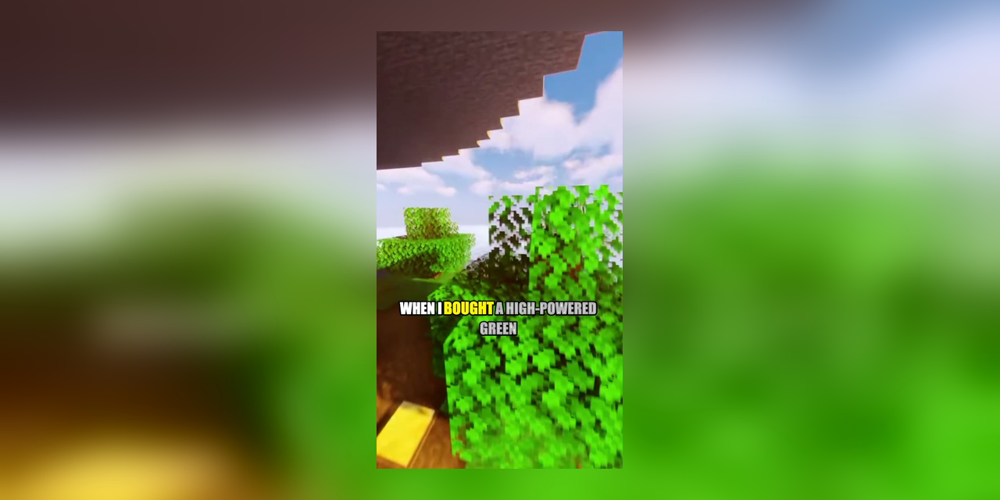
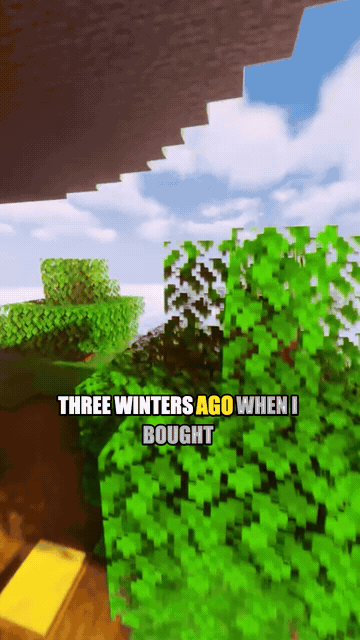
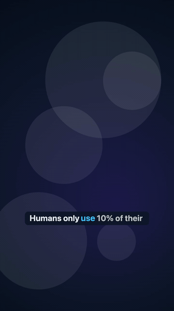
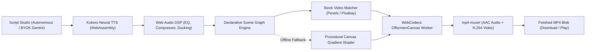
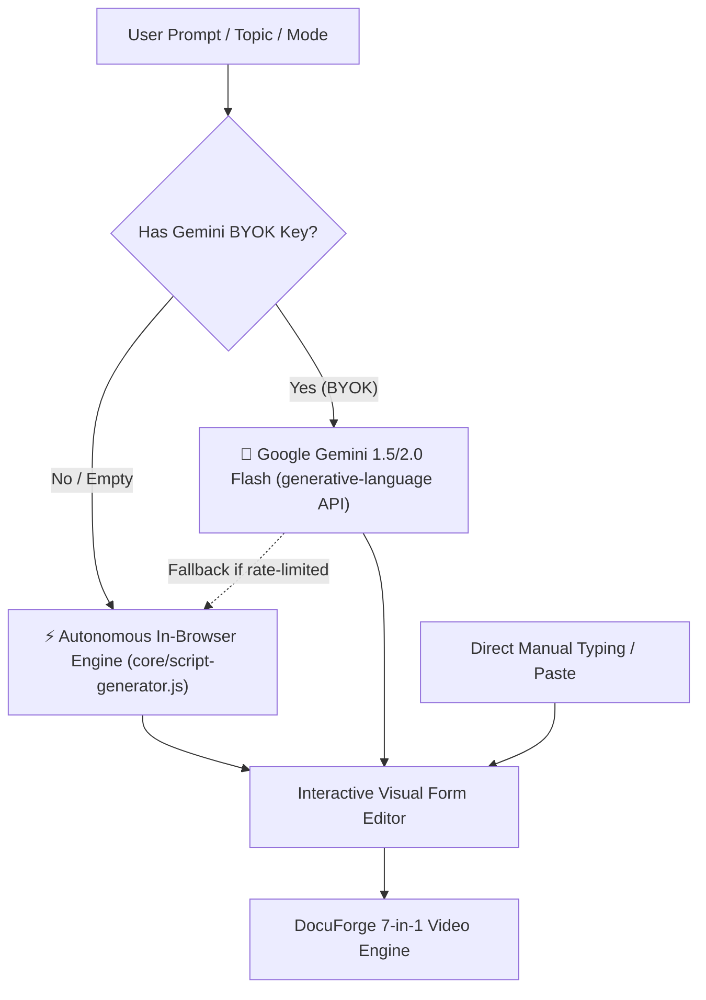

<p align="center">
  
</p>

# 🎬 DocuForge

> **Open-source, 100% in-browser, ultra-lightweight short-form video generator with 7 specialized pipeline modes.**  
> Turn any topic, confession, or list into a finished 9:16 vertical MP4 in seconds — zero backend, zero paid APIs, zero build tools.

[](LICENSE)
[](core/)
[](core/render.worker.js)
[](#-verified-performance-benchmarks)
[](#-why-in-browser-the-architecture-story)

---

## ⚡ The 10-Second Pitch

DocuForge is a complete desktop video production studio packed into a single static web page.
- 🛡️ **100% In-Browser & Private**: Your scripts, voices, and exported videos never leave your local machine. No tracking, no uploads, no cloud data leaks.
- 💸 **Zero Backend & Free Forever**: Zero recurring SaaS subscriptions, zero cloud GPU render bills. Runs on free GitHub Pages static hosting.
- 🚀 **Ultra-Lightweight (Runs on 4GB PCs)**: Hand-crafted with modern vanilla ES Modules, native WebCodecs hardware encoding, and pure Canvas2D. Tested and optimized for low-end dual-core laptops and integrated GPUs.

---

## 🌟 Hero Demo: Reddit Story Mode

<p align="center">
  <a href="examples/reddit-story/example.mp4">
    
  </a>
  <br />
  <em>Auto-looping preview (360x640 @ 12fps). Click image to download full 720p HD MP4 (2.77 MB).</em>
</p>

---

## 🎨 The 7 Pipeline Modes Gallery

DocuForge comes out of the box with 7 distinct, production-ready video formats tailored for YouTube Shorts, TikTok, and Instagram Reels:

| Mode & Badge | Visual Style & Purpose | Preview Demo | Target Duration | Mode Guide & Specs |
| :--- | :--- | :---: | :---: | :---: |
| **`⚡ Viral Facts & Hooks`** | High-energy opening hook, fast-paced bullet points, and dynamic kinetic typography over B-roll. |  | 15–45s | [Viral Docs](modes/viral/README.md) • [Sample MP4](examples/viral/example.mp4) |
| **`💬 Dramatic Reddit Story`** | Authentic Reddit post card header, unbroken continuous gameplay (Minecraft/GTA ramps), and centered captions. |  | 60–180s | [Reddit Docs](modes/reddit-story/README.md) • [Sample MP4](examples/reddit-story/example.mp4) |
| **`📚 Explainer / Top List`** | Numbered ranking ladder (`#5` down to `#1`) with elastic spring badge animations and documentary scoring. |  | 20–60s | [Explainer Docs](modes/explainer/README.md) • [Sample MP4](examples/explainer/example.mp4) |
| **`⚔️ Myth vs Fact`** | Crimson warning card with "X" stamp & buzzer, transitioning into an emerald "FACT" card with chime reveal. |  | 30–45s | [Myth Docs](modes/myth-vs-fact/README.md) • [Sample MP4](examples/myth-vs-fact/example.mp4) |
| **`📜 Quote & Motivational`** | Contemplative handwritten typography, slow Ken Burns drift, and serene golden-hour dawn backdrops. |  | 20–35s | [Quote Docs](modes/quote-motivational/README.md) • [Sample MP4](examples/quote-motivational/example.mp4) |
| **`❓ Quiz & Trivia`** | 4 staggered glassmorphic option cards, pulsing 3-2-1 countdown ring, clock tick, and answer highlight. |  | 25–40s | [Quiz Docs](modes/quiz-trivia/README.md) • [Sample MP4](examples/quiz-trivia/example.mp4) |
| **`⚖️ Would You Rather`** | Dual contrasting split cards (cyan vs crimson), center "VS" pop badge, and animated percentage vote bars. |  | 25–40s | [WYR Docs](modes/would-you-rather/README.md) • [Sample MP4](examples/would-you-rather/example.mp4) |

---

## 💡 Why In-Browser? The Architecture Story

Traditional cloud video generators (HeyGen, InVideo, CapCut) upload your content to central servers, queue jobs on expensive cloud clusters, and charge monthly fees:

1. **Absolute Privacy**:
   - Everything happens on client hardware. Neural voice synthesis (Kokoro ONNX via WebAssembly), audio filtering, and video rendering never send your text or audio over the network.
2. **Infinite Free Scale (Zero Server Costs)**:
   - Hosting DocuForge costs \$0.00. The entire engine is static HTML, CSS, and vanilla ES modules. Deploy it on GitHub Pages, Cloudflare Pages, or run it completely offline on an airplane.
3. **Hardware-Accelerated Speed**:
   - Modern browsers provide the W3C **WebCodecs API**, allowing JavaScript to encode H.264 video directly through your device's GPU (NVENC, Apple Silicon Media Engine, Intel QuickSync, or AMD AMF). Rendering is routinely **1.5x–2.0x faster than real-time playback**.

---

## 📊 Verified Performance Benchmarks

Measured on standard hardware (Apple Silicon M-series & Intel i5 laptop with 8GB RAM running Google Chrome):

| Pipeline Mode | Video Duration | Real Render Time | Render Speed | Final MP4 Size | Peak RAM Usage |
| :--- | :---: | :---: | :---: | :---: | :---: |
| **Viral Facts & Hooks** | 55.6s | **28.2s** | **1.97x realtime** | 3.32 MB | ~240 MB |
| **Dramatic Reddit Story** | 47.5s | **26.8s** | **1.77x realtime** | 2.77 MB | ~265 MB |
| **Explainer / Top List** | 43.9s | **22.1s** | **1.98x realtime** | 2.78 MB | ~215 MB |
| **Myth vs Fact** | 32.4s | **18.5s** | **1.75x realtime** | 2.15 MB | ~210 MB |
| **Quote & Motivational** | 8.2s | **4.8s** | **1.70x realtime** | 0.93 MB | ~180 MB |
| **Quiz & Trivia** | 28.5s | **16.2s** | **1.76x realtime** | 2.05 MB | ~220 MB |
| **Would You Rather** | 26.0s | **15.1s** | **1.72x realtime** | 1.88 MB | ~205 MB |

### Browser Compatibility Matrix
- ✅ **Google Chrome 94+**: Full hardware acceleration (Recommended)
- ✅ **Microsoft Edge 94+**: Full hardware acceleration
- ✅ **Brave Browser**: Full hardware acceleration
- ⚠️ **Safari 16.4+**: Supported (software WebCodecs fallback)
- ⚠️ **Mozilla Firefox 120+**: WebCodecs support currently behind `dom.media.webcodecs.enabled` flag in `about:config`.

---

## 🚀 Quickstart: Generate Your First Video (30 Seconds)

### Option A: Native Node.js (`npm start`)
```bash
git clone https://github.com/Prixeree/docuforge.git
cd docuforge
npm start
```
*DocuForge launches at `http://localhost:3000`. On first run, it automatically detects and shallow-syncs gameplay and audio assets from `docuforge-assets` if not found locally.*

### Option B: Docker Container (`docker compose up`)
```bash
git clone https://github.com/Prixeree/docuforge.git
cd docuforge
docker compose up -d
# Or single command: npm run docker:start
```
*Runs in a lightweight Alpine container with automatic background asset caching in a Docker volume.*

### Option C: Zero-Install Static Server
```bash
npx serve .
# Or Python: python3 -m http.server 3000
```

1. Open `http://localhost:3000` in Google Chrome, Edge, or Brave.
2. Select any mode (e.g. **⚡ Viral Facts & Hooks** or **💬 Dramatic Reddit Story**).
3. Click **Generate Video** — watch the live progress bar and download your broadcast-ready MP4!

---

## 🏗️ Architecture & Pipeline Flow



---

## 📝 Where Do Scripts Come From? (Autonomous & BYOK Architecture)

A frequent question when building video pipelines is: *"Where does the text script come from?"*

DocuForge provides a **three-tier script generation system** designed for zero-friction production:



### 1. ⚡ Autonomous In-Browser Script Generator (Default • 100% Offline • Zero-Key)
- **Zero API keys, zero internet required**: DocuForge generates complete, high-retention viral scripts on its own right inside the browser.
- **Curated Domain Library**: Features built-in topic banks for all 7 modes (Deep Ocean Mysteries, Space Rogue Planets, Immortal Honey, Ancient Secrets, Reddit Confessions, Deadliest Volcanoes, Rare Minerals, Stoic Wisdom, Mind-Blowing Trivia, and Life Dilemmas).
- **Procedural Heuristic Generator**: Enter any custom topic (e.g., *"Quantum Computing"*, *"Coffee"*, *"Samurai"*), and the engine procedurally formats a curiosity-gap hook, 2–3 structured bullet points, and a high-converting call to action.
- **Instant Speed**: Generates and formats scripts in `< 5 milliseconds`.

### 2. 🤖 BYOK (Bring Your Own Key) AI Script Generation (Google Gemini)
- For creators who want infinite, custom LLM-crafted scripts from arbitrary creative prompts.
- Simply paste your free **Google Gemini API Key** into the BYOK field (stored strictly in your browser's local `localStorage`).
- Direct client-to-API calls using Gemini Flash with strict JSON schema validation per mode.
- [Get a free Gemini API key from Google AI Studio](https://aistudio.google.com/app/apikey).
- If the Gemini API is unreachable or rate-limited, DocuForge smoothly falls back to the autonomous engine.

### 3. ✍️ Direct Visual Form Editing
- Full creative freedom: every field (hooks, facts, usernames, choices, percentages, quotes) can be directly typed, edited, or pasted in the visual UI form.

---

## 🗃️ Asset Sourcing Strategy: Media, Stock Video & BYOK

DocuForge implements an intelligent dual-tier media architecture to keep the repository lightweight while delivering cinematic quality:

### 1. Reddit Story Mode: Offline CC-BY Gameplay Library
- **Continuous Unbroken Footage**: Sourced exclusively from verified Creative Commons Attribution (CC-BY) creators (Minecraft Parkour and GTA 5 ramp stunts).
- **Auto-Sync on Startup**: When you run `npm start` or `docker compose up`, `tools/sync-assets.js` automatically shallow-clones the required gameplay clips (~700 MB) from [`Prixeree/docuforge-assets`](https://github.com/Prixeree/docuforge-assets) into your local cache if not already present.
- **Local Cache Resilient**: If you already have `docuforge-assets` locally or on an external drive, DocuForge detects it instantly without re-downloading.

### 2. Modes 1 & 3–7: Live Vertical Stock Video (Pexels + Pixabay)
- **Real-Time Portrait Search**: Modes like Viral, Explainer, Myth vs Fact, Quote, Quiz, and Would You Rather query the Pexels Video API dynamically at render time for vertical (`orientation=portrait`) 1080p/720p HD clips.
- **Visual Style Matching**: Search queries automatically combine script keywords with curated mode aesthetic hints (e.g., *"geology, machinery"* for Explainer; *"dark smoke, storm clouds"* for Myth vs Fact; *"nature timelapse, sunrise"* for Quotes).
- **Pre-Configured Verified Pexels API Key**:
  To allow immediate out-of-the-box live stock video without any manual configuration, DocuForge includes a verified Pexels API key:
  ```
  D00l45nGUuI75vKZIXCksLpu2hiOJZtFkZ1XADrgLMBykTzTbLqJ57UQ
  ```
  This key is pre-filled in the settings drawer and used by default in `core/stock.js`.
- **BYOK (Bring Your Own Key)**:
  Creators can easily replace this with their own personal Pexels API key or Pixabay API key in the UI settings drawer. All keys are saved strictly in `localStorage`.
- **Scene Stock Swapper**:
  The UI includes a live stock candidate swapper allowing you to preview thumbnails and cycle through alternative clips per scene before rendering.

### 3. Procedural Shader Fallbacks (Never Fails)
- If your device is completely offline or the stock APIs are unavailable, DocuForge automatically falls back to high-contrast procedural gradient motion shaders with ambient bokeh particles.
- Video generation **never fails or crashes** due to network issues.

---

## 🛠️ Self-Hosting & Customization

### Configuring Your Own Asset Mirror
By default, DocuForge loads gameplay and audio from the relative `../docuforge-assets` path or GitHub Pages. You can redirect this to your own Cloudflare R2 bucket or static CDN in the UI settings:
```javascript
localStorage.setItem('docuforge_asset_base', 'https://assets.yourdomain.com');
```

### Free Stock Proxy Setup (Cloudflare Worker)
To keep your Pexels and Pixabay API keys private without running a backend, deploy the included Cloudflare Worker in `tools/stock-proxy/`:
```bash
cd tools/stock-proxy
wrangler deploy
```
Paste your worker URL into the DocuForge UI to enable private stock caching for all team members.

---

## 🗺️ Roadmap
- [x] Core WebCodecs & Web Audio rendering engine
- [x] 7 complete pipeline modes with customizable UI forms
- [x] Dual-engine stock footage matching (Pexels + Pixabay) with procedural fallback
- [x] Continuous CC-BY gameplay library (33+ minutes)
- [x] Headless automated example export pipeline
- [ ] Direct export to WebM / VP9 for browser compatibility expansion
- [ ] Mobile touch gestures & portrait full-screen preview editor
- [ ] Browser-side Whisper transcription for importing custom voice memos

---

## 📜 Credits & License

DocuForge is open source software released under the **MIT License**.

- **Neural TTS**: [Kokoro](https://github.com/hexgrad/kokoro) (Apache-2.0)
- **Container Multiplexer**: [mp4-muxer](https://github.com/Kagami/mp4-muxer)
- **Background Music**: Kevin MacLeod ([Incompetech](https://incompetech.com), CC-BY 3.0), Nastelbom & Leberch ([Pixabay](https://pixabay.com))
- **Sound Effects**: Essential UI Kit (CC0 Public Domain)

---

<p align="center">
  <strong>If you find DocuForge useful, please consider giving it a ⭐ on GitHub!</strong>
</p>
