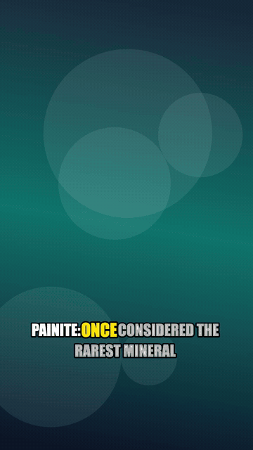

# 📚 DocuForge Explainer / Top List Mode

> Transform any top-N list, scientific concept, or educational breakdown into a polished 20–60s vertical short with animated ranking badges, documentary pacing, and kinetic subtitles.

<p align="center">
  
</p>

---

## 🎬 Visual Structure
1. **Title / Hook Scene (0:00 - 0:03)**: Introduces the topic with a crisp category badge and bold headline typography.
2. **Rank Ladder Scenes (#5 down to #1)**:
   - **Elastic Rank Badges**: Vivid circular `#N` badge springs into the upper third of the frame with a spring physics easing curve.
   - **Contextual B-Roll**: Live portrait footage searched via Pexels/Pixabay or dynamic emerald procedural gradient motion.
   - **Subtle Wipe Transitions**: Crisp directional wipes cleanly separate each ranked item.
3. **Closing Summary**: Final concluding fact or open question prompting viewer discussion.

---

## 📋 Input Format

### 1. Minimal JSON Input (`input.json`)
```json
{
  "mode": "explainer",
  "title": "Top 5 Rarest Minerals on Earth",
  "items": [
    { "rank": 1, "name": "Painite", "line": "Painite: Once considered the rarest mineral on Earth with only two known crystals in existence for decades." },
    { "rank": 2, "name": "Kyawthuite", "line": "Kyawthuite: Only a single natural specimen of this deep reddish-orange gemstone has ever been found in Burma." },
    { "rank": 3, "name": "Taaffeite", "line": "Taaffeite: Over a million times rarer than diamonds, discovered by a gemologist who noticed unusual refraction." },
    { "rank": 4, "name": "Jeremejevite", "line": "Jeremejevite: A magnificent sky-blue boron mineral crystal found exclusively in deep granitic pegmatites." },
    { "rank": 5, "name": "Poudretteite", "line": "Poudretteite: An ultra-rare pink hexagonal crystal first documented at Mont Saint-Hilaire, Quebec." }
  ],
  "settings": {
    "subtitlePreset": "bold-pop",
    "voice": "bm_george",
    "music": "music/nastelbom-documentary-documentary-music-606698.mp3",
    "quality": "hd"
  }
}
```

---

## 🎛️ Customization Knobs
- **Rank Count**: Flexible from Top 3 up to Top 10 items.
- **Badge Color Theme**: Cyan `#38BDF8`, Amber `#F59E0B`, or Emerald `#10B981`.
- **Transitions**: Directional Wipe, Crossfade, or Zoom Cut between items.
- **Documentary Scoring**: Pre-tuned ducking for inquisitive music tracks (e.g. Nastelbom Documentary Music).
- **Subtitles**: `classic` pill badge or `bold-pop` kinetic pop text.

---

## 🚀 Run It Yourself
```bash
git clone https://github.com/docuforge/docuforge.git
cd docuforge
npx serve .
```
1. Select **Explainer / Top List** mode.
2. Enter your title and ranked items.
3. Hit **Generate Video** — clean, high-framerate MP4 renders right inside your browser.

---

## 🔄 Reproduce This Example
```bash
node tools/export-examples.js explainer
```
Input definition: [examples/explainer/input.json](../../examples/explainer/input.json)

---

## 📜 Asset Credits & Licenses
- **Music**: *Documentary Documentary Music* by Nastelbom (Pixabay Content License).
- **TTS**: Kokoro Neural TTS (Apache-2.0).
- **Icons & Badges**: Procedurally generated vector canvas sprites (CC0).

See full details in [examples/explainer/credits.md](../../examples/explainer/credits.md).
